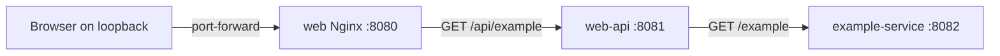
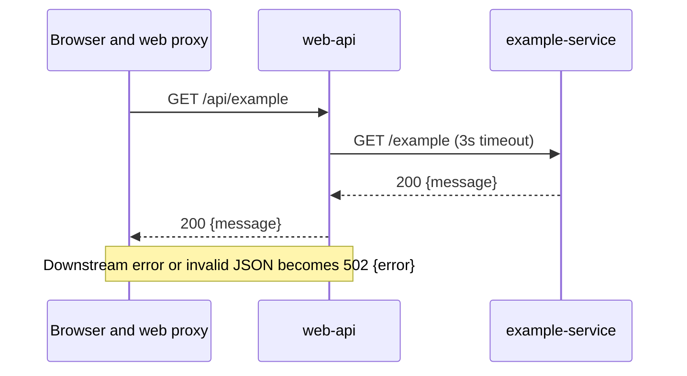

# Starter system design

This document describes the implemented local example. Generated projects should replace its sample problem, domain, and diagrams with their own verified design.

## 1. Abstract

A browser displays a synthetic message supplied by a Rust service through a separate Rust web API. All three applications are deployed to Kind with Helm. This demonstrates a browser-to-service and service-to-service HTTP boundary. It is a local PoC, not a production architecture or capacity claim.

## 2. Goals and non-goals

- **Goals:** deploy to a local Kind cluster from a clean checkout; show an explicit contract and owner for each HTTP hop; expose a visible success and error state in Vue; configure probes and resource budgets.
- **Non-goals:** persistent state, authentication, queue processing, measured scalability, high availability, and production deployment.

## 3. Background and problem

The template needs a small, replaceable workflow that proves the Rust/Vue integration and Kind packaging, giving new projects a concrete documentation example. The domain message is synthetic and carries no business meaning.

## 4. Proposed architecture

The diagram shows the current implementation:

| Component | Owner | Responsibility |
| --- | --- | --- |
| `web` | `web/` | Display response and recovery state. |
| `web-api` | `services/web-api/` | Browser endpoint, downstream timeout, 502 translation. |
| `example-service` | `services/example-service/` | Authoritative sample message. |

Nginx proxies `/api` to the `web-api` ClusterIP Service in Kind; Vite performs the same role in optional process-only development. The chart sets `BIND_ADDRESS=0.0.0.0` inside the Rust containers and exposes only ClusterIP Services. The browser enters through a loopback-bound port forward.

## 5. Request lifecycle

The browser shows an error and a retry button after a failed request. There are no writes or background jobs.

## 6. API and data contracts

[The OpenAPI file](contracts/openapi.yaml) is the HTTP contract. `example-service` owns `/example`; `web-api` consumes it and owns `/api/example`; `web` consumes the latter. The catalog is in [contracts/README.md](contracts/README.md). There is no database model or event schema.

## 7. Consistency, idempotency, and replay

Both operations are read-only. There is no stored state, retry at the service layer, ordering guarantee, or replay mechanism. Browser retry sends a new GET.

## 8. Security and privacy

The sample uses synthetic text and no credentials. The chart exposes only ClusterIP Services, and the documented port forward binds to loopback. These are local PoC boundaries, not application authentication. A generated project must design authentication, authorization, input validation, logging, and data retention for its real use case.

## 9. Operational readiness

See [operations](operations.md), the [Helm chart](../deploy/helm/microservices-poc/README.md), and [resource budgets](kubernetes-resources.md). Each of the three Deployments defaults to two replicas and has liveness/readiness probes. `/health` only reports that each Rust process can respond; it does not verify downstream dependencies. Nginx has `/healthz`. There is no persistent state, so data recovery does not apply.

## 10. Alternatives considered

| Option | Benefit | Cost | Template choice |
| --- | --- | --- | --- |
| One Rust API and Vue | Smallest runnable app | No service-to-service example | Not selected for this template. |
| Two Rust services and Vue | Demonstrates an owned boundary and failure translation | Extra local process | Selected. |
| Add database and broker to Kind | Shows stateful patterns | Imposes unrelated domain and operational choices | Defer until a PoC needs them. |

## 11. Open questions

The generated project must decide real service boundaries, persistence, security, Kind resource budgets, and measurable acceptance criteria.

## 12. Decision and next steps

Keep the Kind baseline small and replace the sample path during project adoption. Run the checks and deployment in the [root README](../README.md) and record observed results under [verification](verification/README.md).

## 13. References

- [Root README](../README.md) · [Contract catalog](contracts/README.md) · [ADR index](adr/README.md).
